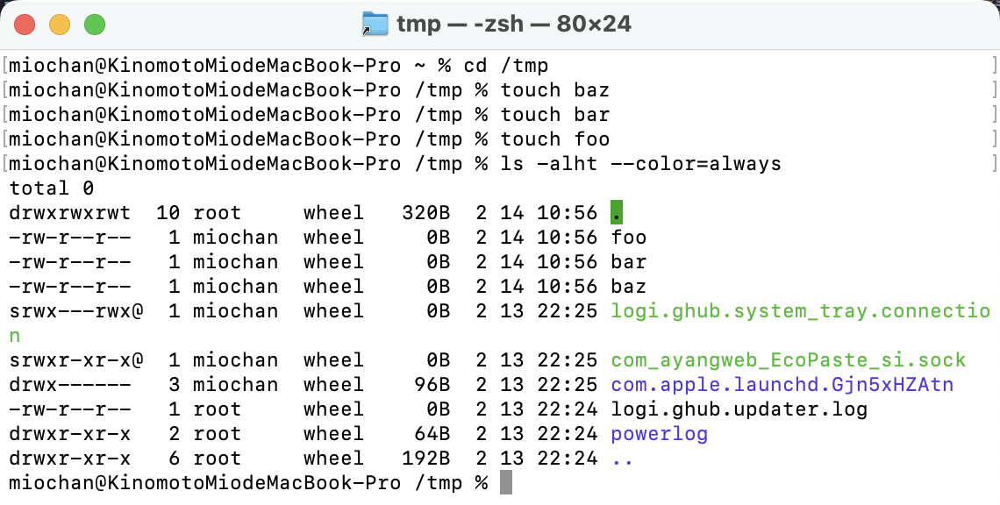
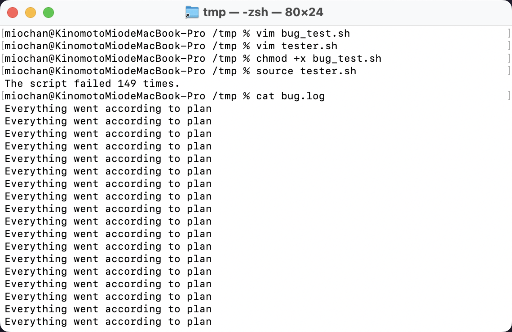
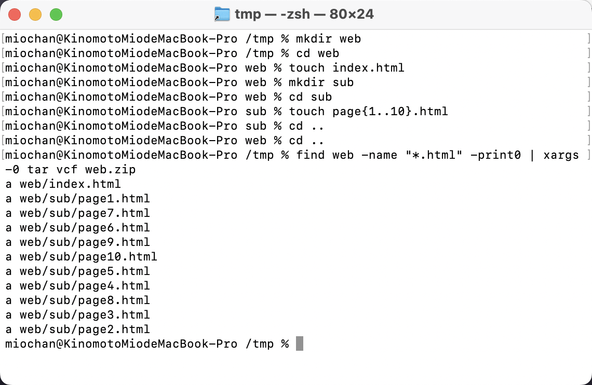
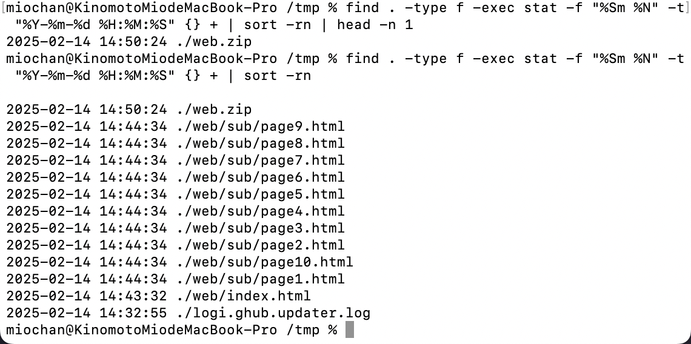

## Exercises

1. Read [`man ls`](https://www.man7.org/linux/man-pages/man1/ls.1.html) and write an `ls` command that lists files in the following manner

- Includes all files, including hidden files
- Sizes are listed in human readable format (e.g. 454M instead of 454279954)
- Files are ordered by recency
- Output is colorized
A sample output would look like this

```bash
-rw-r--r--   1 user group 1.1M Jan 14 09:53 baz
drwxr-xr-x   5 user group  160 Jan 14 09:53 .
-rw-r--r--   1 user group  514 Jan 14 06:42 bar
-rw-r--r--   1 user group 106M Jan 13 12:12 foo
drwx------+ 47 user group 1.5K Jan 12 18:08 ..
```

My solution:

Use `man ls` to get the command line options' descriptions, or use `tldr ls` to get a quick summary.
+ List **[a]ll** files, including hidden files: `ls -a`
+ List files in **[l]ong** format with size displayed using **[h]uman-readable** units (KiB, MiB, GiB): `ls -lh`
+ `-t`: Sort by descending time modified (most recently modified first). If two files have the same modification timestamp, sort their names in ascending lexicographical order. The `-r` option reverses both of these sort orders.
+ Colorize output: `ls --color=auto` or `ls --color=always`. The first option will only colorize the output when it is being piped to another command, the second option will always colorize the output.




2. Write bash functions `marco` and `polo` that do the following. Whenever you execute `marco` the current working directory should be saved in some manner, then when you execute `polo`, no matter what directory you are in, `polo` should `cd` you back to the directory where you executed `marco`. For ease of debugging you can write the code in a file `marco.sh` and (re)load the definitions to your shell by executing `source marco.sh`.

My solution:
``` bash
#!/usr/bin/env bash
# marco.sh

# Function to save the current working directory
function marco() {
    # Save the current working directory to a temporary file
    pwd > "$HOME/marco_directory.log"
}

# Function to return to the saved directory
function polo() {
    # Check if the file containing the saved directory exists
    if [ -f "$HOME/marco_directory.log" ]; then
        # Read the saved directory from the file
        target_dir=$(cat "$HOME/marco_directory.log")
        # Change the current directory to the saved directory
        cd "$target_dir"
    else
        # Redirect standard output to standard error
        echo "Error: The 'marco' function has not been executed yet." >&2
    fi
}
```


3. Say you have a command that fails rarely. In order to debug it you need to capture its output but it can be time consuming to get a failure run. Write a bash script that runs the following script until it fails and captures its standard output and error streams to files and prints everything at the end. Bonus points if you can also report how many runs it took for the script to fail.

``` bash
#!/usr/bin/env bash

n=$(( RANDOM % 100 ))

if [[ n -eq 42 ]]; then
    echo "Something went wrong"
    >&2 echo "The error was using magic numbers"
    exit 1
fi

echo "Everything went according to plan"
```

My solution:

First, I save the script above to a file named `bug_test.sh`. Then, I create a bash script named `tester.sh` to finish the task.
```bash
#!/usr/bin/env bash

count=0

./bug_test.sh >>& bug.log

until [[ "$?" -ne 0 ]]; do
    ((count++))
    ./bug_test.sh >>& bug.log
done

echo "The script failed $count times."
```



4. As we covered in the lecture `find`’s `-exec` can be very powerful for performing operations over the files we are searching for. However, what if we want to do something with **all** the files, like creating a zip file? As you have seen so far commands will take input from both arguments and STDIN. When piping commands, we are connecting STDOUT to STDIN, but some commands like `tar` take inputs from arguments. To bridge this disconnect there’s the [`xargs`](https://www.man7.org/linux/man-pages/man1/xargs.1.html) command which will execute a command using STDIN as arguments. For example `ls | xargs rm` will delete the files in the current directory.
Your task is to write a command that recursively finds all HTML files in the folder and makes a zip with them. Note that your command should work even if the files have spaces (hint: check `-d` flag for `xargs`).
If you’re on macOS, note that the default BSD find is different from the one included in [GNU coreutils](https://en.wikipedia.org/wiki/List_of_GNU_Core_Utilities_commands). You can use `-print0` on `find` and the `-0` flag on `xargs`. As a macOS user, you should be aware that command-line utilities shipped with macOS may differ from the GNU counterparts; you can install the GNU versions if you like by [using brew](https://formulae.brew.sh/formula/coreutils).

My solution:

First, create some empty html files for the test. Then, run the following command:

```bash
find web -name "*.html" -print0 | xargs -0 tar cfv web.zip
```



5. (Advanced) Write a command or script to recursively find the most recently modified file in a directory. More generally, can you list all files by recency?

My solution:

```bash
# Find the most recently modified file in the current directory and list modification time in human-readable format
find . -type f -exec stat -f "%Sm %N" -t "%Y-%m-%d %H:%M:%S" {} + | sort -rn | head -n 1
# List all files by recency and list modification time in human-readable format
find . -type f -exec stat -f "%Sm %N" -t "%Y-%m-%d %H:%M:%S" {} + | sort -rn
```

